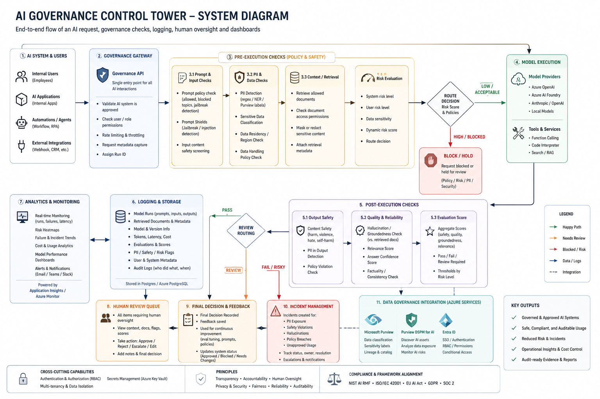

# AI Governance Control Tower



**Document version:** 0.1  
**Date:** 2026-05-12  
**Project mode:** Local-first MVP, Azure-aware architecture  

> This project is a prototype governance layer for registering, monitoring, evaluating, reviewing, and auditing AI systems. It is not a legal compliance product and should not be marketed as guaranteeing compliance with any law, standard, or certification.


## Purpose

The AI Governance Control Tower is a flagship project for demonstrating how organisations can govern AI systems after, around, and before AI applications are deployed.

This project shows the operational layer that a serious organisation needs around those systems:

- A registry of AI systems and owners.
- Approval workflows and risk levels.
- A governance gateway for model calls.
- Pre-execution checks before model use.
- Post-execution evaluations after generation.
- PII and safety flags.
- Human review queues.
- Incidents, audit logs, exports, and dashboards.
- A final governance dashboard with KPI cards, risk heatmap, incident summary, failed evaluations, model usage, cost, latency, and audit export.
- Local-first development with Azure integration paths.
- Persistent model run evidence for prompt, input, output, retrieval context, provider metadata, cost, and latency.
- Local regex PII detection for synthetic demo patterns, with incident creation and redacted snippets.
- Local evaluation providers for output quality signals, including a deterministic baseline, a stronger semantic-local heuristic, and an optional Ollama local judge.
- Exportable run-level evidence packs for audit review, including system, prompt, model run, retrieved documents, run steps, evaluations, incidents, reviews, and audit events.
- Filtered audit exports as CSV or JSON for system, department, date range, risk level, and incident type.

Planned governance controls include PII detection with Presidio/Microsoft Presidio plus regex, NER, and entity detection fallback; prompt injection and jailbreak detection; pre-LLM redaction for names, emails, phone numbers, and account numbers; role-based access for admin, analyst, reviewer, and auditor; and audit evidence for prompts, outputs, retrieved docs, approvals, costs, and reviewer actions.

V2 should evolve the product into a genuine multi-agent governance system with dedicated Retrieval, Evaluation, Compliance, Human Review, and Reporting agents. Local Ollama and later external providers should plug in as bounded backend agents with typed contracts, explicit permissions, fallback behaviour, and audit trails.

## Product thesis

> You cannot govern what you cannot see.

The Control Tower gives visibility, control, accountability, and evidence around organisational AI use. It should feel closer to a security operations centre, risk terminal, or mission-control platform than a generic SaaS analytics dashboard.

## Handover document index

| Document | Purpose |
|---|---|
| `IMPLEMENTATION.md` | Concrete build plan, stack, folder structure, local setup, feature order, acceptance criteria. |
| `ARCHITECTURE.md` | System architecture, data flow, provider abstractions, local and Azure target architecture. |
| `DESIGN.md` | Visual direction, colour palette, typography, layout principles, component guidance. |
| `ROADMAP.md` | Phased roadmap from local MVP to Azure-integrated demo and production hardening. |
| `AGENTS.md` | Development-agent instructions plus product agent/service responsibilities. |
| `SECURITY.md` | Secure design principles, threat model, LLM security controls, engineering checklist. |
| `DATA_MODEL.md` | Database entities, relationships, enums, lifecycle states, schema guidance. |
| `API_SPEC.md` | FastAPI endpoint design, request/response examples, error handling conventions. |
| `AZURE_INTEGRATION.md` | Azure service mapping, integration phases, deployment target, security considerations. |
| `GOVERNANCE_MODEL.md` | Risk model, approval workflow, human review routing, evaluation policy. |
| `AGENT_GOVERNANCE_PLAN.md` | Next-build plan for policy decisions, agent identity, tool governance, and capability controls. |
| `BUSINESS_TRANSITION_PLAN.md` | Explains how the mock/local prototype becomes a real organisational AI governance gateway. |
| `TESTING.md` | Test strategy for backend, frontend, evaluations, security, accessibility, and demo data. |
| `DEMO_SCRIPT.md` | YouTube and stakeholder demo scenario, seed data, story beats, key screenshots. |
| `ENVIRONMENT.md` | Local environment variables, secrets model, dev/prod configuration conventions. |

## Recommended MVP stack

| Layer | Local MVP | Azure-ready equivalent |
|---|---|---|
| Frontend | Next.js, TypeScript, Tailwind, shadcn/ui, Recharts/Nivo/TanStack Table | Azure Static Web Apps or Azure App Service |
| API | FastAPI, Pydantic, SQLAlchemy | Azure Container Apps or App Service |
| Database | Local Postgres via Docker Compose | Azure Database for PostgreSQL |
| LLM | Mock/local provider first, OpenAI/Anthropic optional | Azure OpenAI / Microsoft Foundry models |
| Safety checks | Local regex/heuristics/Presidio-style checks | Azure AI Content Safety, Prompt Shields, groundedness detection |
| Secrets | `.env.local` only | Azure Key Vault with managed identity |
| Identity | Local mock users and RBAC | Microsoft Entra ID |
| Telemetry | Local logs and DB audit events | Azure Monitor + Application Insights / OpenTelemetry |
| Data governance | Local data source metadata | Microsoft Purview integration later |

## Local quick start

Episode 1 creates the runnable local monorepo shell:

```text
backend/   FastAPI app, typed settings, health endpoint, database session placeholder
frontend/  Next.js command-centre dashboard shell
infra/     Local orchestration notes and future infrastructure templates
docs/      Architecture, design, environment, testing, and governance documentation
```

Start all local services from the repository root:

```bash
docker compose up --build
```

Then open:

- Frontend dashboard: http://localhost:3000
- Backend health: http://localhost:8000/health
- FastAPI docs in local mode: http://localhost:8000/docs

The default local database is Postgres on `localhost:5432` with database `aigov`. The compose setup uses development-only credentials from the example environment files.

## Local development without Docker

Backend:

```bash
cd backend
python -m venv .venv
source .venv/bin/activate
pip install -e ".[dev]"
uvicorn app.main:app --reload
```

Frontend:

```bash
cd frontend
npm install
npm run dev
```

## Smoke checks

Backend health test:

```bash
cd backend
pytest
```

Frontend type check:

```bash
cd frontend
npm run typecheck
```

## Local Ollama Provider

The backend provider boundary is interchangeable. The frontend never calls an LLM directly; every model request goes through `POST /governance/run`, then approval, PII, logging, evaluation, review routing, incidents, and audit events are applied.

To test a local Ollama model later, run Ollama on the host and set the backend environment:

```text
LLM_PROVIDER=ollama
OLLAMA_BASE_URL=http://host.docker.internal:11434
OLLAMA_MODEL=llama3.1
```

The same boundary supports the local mock provider today and future Azure/OpenAI adapters later. A failed provider call is still recorded as a failed model-run shell with gateway step evidence.

## Showcase Seed Data

Fresh local installs seed a synthetic but product-like showcase dataset when `ENABLE_DEMO_SEED=true`.

The showcase includes:

- `Customer Support Summariser`: approved, medium risk, active prompt governance, run history, PII incident, and pending review.
- `Sales Email Generator`: approved, low risk, run history, and active prompt.
- `Procurement Policy Assistant`: approved, medium risk, retrieved policy context, run history, and evaluation evidence.
- `HR CV Screening Assistant`: blocked, high risk, showing how the gateway prevents unapproved HR use.

The seeded data is designed to make the dashboard useful immediately: it includes a blocked high-risk system, a PII incident, failed-evaluation/review evidence, visible run costs, and latency metrics.

To re-add the showcase after clearing local data:

```bash
docker compose run --rm backend python -m app.cli seed-showcase
```

With Ollama enabled in `backend/.env`, open `Customer Support Summariser`, inspect the **Prompt Governance** panel, then use **Test Run**. The request will use the active prompt version and call Ollama through the backend governance gateway.

## Environment files

Example templates are committed at:

- `.env.example`
- `backend/.env.example`
- `frontend/.env.example`

Do not commit real secrets. Frontend environment variables must remain limited to safe `NEXT_PUBLIC_*` values.

## Core product objects

- **AI System:** Registered use case such as Customer Support Summariser.
- **Prompt Version:** Versioned prompt attached to an AI system.
- **Model Run:** A single governed AI interaction.
- **Evaluation Result:** Automated checks run against a model run.
- **Human Review:** Manual decision on risky or uncertain output.
- **Incident:** A governance event such as PII exposure, hallucination, jailbreak, or unapproved use.
- **Audit Event:** Append-only record of who changed what and when.

## Key demo narrative

1. Register a new AI system: `Customer Support Summariser`.
2. Assign owner, department, model, data sources, personal data status, risk level, and approval status.
3. Submit a model request through the governance gateway.
4. Pre-execution checks inspect approval status, prompt policy, PII, jailbreak attempts, data-source permissions, and risk.
5. The model call is allowed, blocked, or held for review.
6. Post-execution checks inspect output safety, PII, groundedness, hallucination, relevance, and policy violations.
7. Risky runs go into human review.
8. Final decision is logged.
9. Dashboard shows organisation-level AI risk posture, cost, incidents, model runs, review queue, and audit trail.

## Visual references

The generated concept assets are included in `assets/`:

- `assets/system-diagram-concept.png`
- `assets/dashboard-design-concept.png`

These are directional only. The implementation should follow `DESIGN.md`, not copy the generated image literally.

## External reference anchors

Use these as reference anchors during build, but verify details before cloud integration:

- NIST AI Risk Management Framework: https://www.nist.gov/itl/ai-risk-management-framework
- NIST AI RMF Core: https://airc.nist.gov/airmf-resources/airmf/5-sec-core/
- OWASP Top 10 for LLM Applications: https://owasp.org/www-project-top-10-for-large-language-model-applications/
- Azure AI Content Safety: https://learn.microsoft.com/en-us/azure/ai-services/content-safety/
- Azure Prompt Shields: https://learn.microsoft.com/en-us/azure/ai-services/content-safety/concepts/jailbreak-detection
- Azure groundedness detection: https://learn.microsoft.com/en-us/azure/ai-services/content-safety/concepts/groundedness
- Microsoft Foundry evaluations: https://learn.microsoft.com/en-us/azure/foundry/how-to/evaluate-generative-ai-app
- Azure Key Vault: https://learn.microsoft.com/en-us/azure/key-vault/
- Azure Monitor Application Insights OpenTelemetry: https://learn.microsoft.com/en-us/azure/azure-monitor/app/opentelemetry-enable
- Microsoft Entra ID: https://learn.microsoft.com/en-us/entra/identity/
