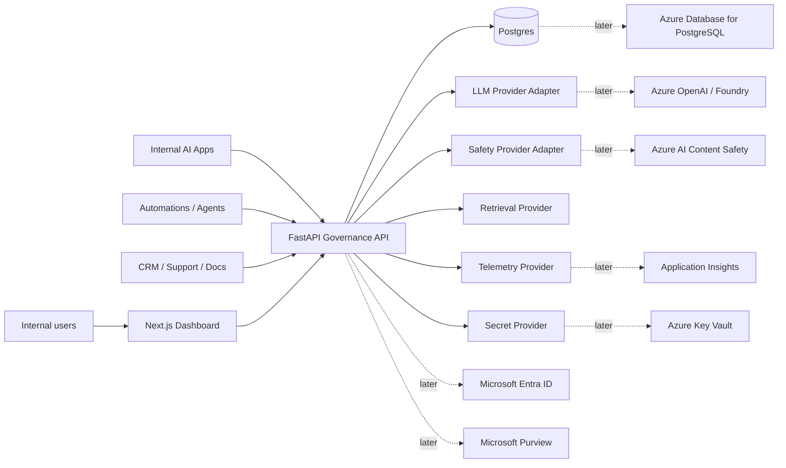
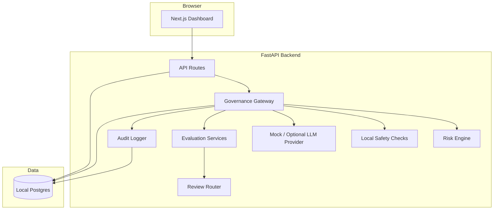
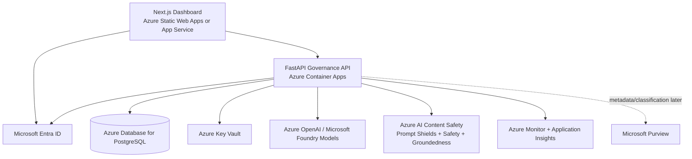
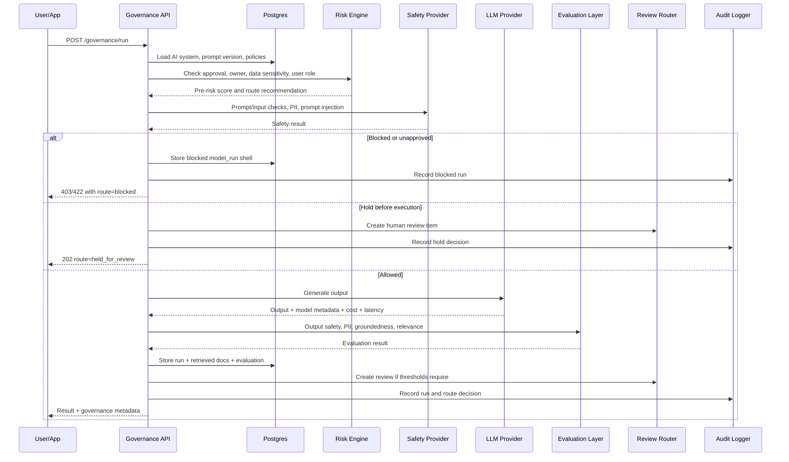
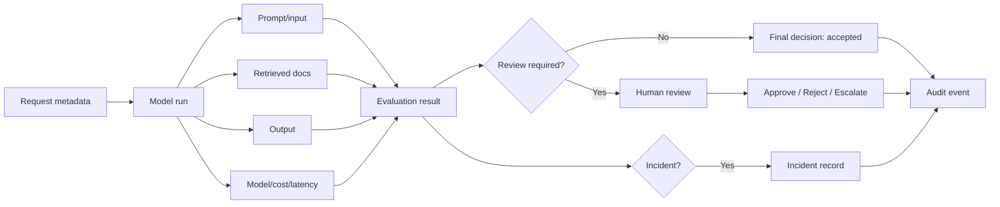

# AI Governance Control Tower

**Document version:** 0.1  
**Date:** 2026-05-12  
**Project mode:** Local-first MVP, Azure-aware architecture  

> This project is a prototype governance layer for registering, monitoring, evaluating, reviewing, and auditing AI systems. It is not a legal compliance product and should not be marketed as guaranteeing compliance with any law, standard, or certification.


## Architecture summary

The platform is a governance layer around AI usage. It does not assume that all AI systems are built inside this product. Instead, it provides a central control plane and a gateway that AI applications can route through.

```text
AI apps / users / agents
        ↓
Governance Gateway API
        ↓
Pre-execution checks
        ↓
Model execution provider
        ↓
Post-execution evaluations
        ↓
Run log + evaluation + incident/review routing
        ↓
Next.js dashboard + audit exports
```

## Architectural style

- **Control plane:** registry, approvals, risk levels, policies, dashboards.
- **Runtime gateway:** checks and logs each model run.
- **Provider abstraction:** local providers now, Azure providers later.
- **Event/audit orientation:** every significant state change creates an audit event.
- **Human-in-the-loop:** risky outputs are not only scored; they are routed to accountable reviewers.

## System context



## Local architecture



## Episode 1 runnable scaffold

The initial local monorepo uses a small service split that matches the target architecture without adding real provider dependencies yet:

- `backend/`: FastAPI application with `GET /health`, typed environment settings in `app/core/config.py`, and a SQLAlchemy session placeholder in `app/db/session.py`.
- `frontend/`: Next.js dashboard shell using the dark operational design system from `DESIGN.md`.
- `docker-compose.yml`: local Postgres, backend, and frontend orchestration.
- `infra/`: local orchestration notes and placeholder location for later Azure-aware templates.

Provider integrations remain interface-level decisions for later phases. No LLM calls run in the frontend, and no Azure resources are provisioned by the local compose setup.

## Target Azure-aware architecture



## Governance gateway sequence



## Route decision model

The gateway returns one of four route decisions:

| Decision | Meaning | User-facing behaviour |
|---|---|---|
| `allow` | Checks pass; output may be returned. | Return result and log run. |
| `allow_with_review` | Output returned but review item created. | Return result with warning metadata. |
| `hold_for_review` | Output not returned until human review. | Return review ID and reason. |
| `block` | Request violates policy, uses blocked system, or exceeds risk threshold. | Return blocked response and create incident/audit event if required. |

## Core data flow



## Component responsibilities

### Next.js dashboard

Responsible for:

- Registry UI.
- Dashboards and visualisations.
- Human review actions.
- Incident workflows.
- Audit export views.
- Settings and integration status.

Not responsible for:

- Calling LLMs.
- Storing secrets.
- Making final route decisions.
- Running sensitive safety checks in the browser.

### FastAPI backend

Responsible for:

- API contracts.
- Auth and permissions.
- Governance gateway.
- Business rules.
- Risk scoring.
- Provider orchestration.
- Persistence.
- Audit logging.
- Export generation.

### Postgres

Responsible for:

- System registry.
- Run logs.
- Evaluations.
- Review states.
- Incidents.
- Audit events.
- Integration metadata.

### Provider layer

Responsible for isolating external dependencies:

| Interface | Local implementation | Azure implementation |
|---|---|---|
| `LLMProvider` | Mock or optional OpenAI/Anthropic | Azure OpenAI / Foundry |
| `SafetyProvider` | Regex/heuristics | Azure AI Content Safety |
| `GroundednessProvider` | Source-overlap heuristic | Azure groundedness detection |
| `SecretManager` | Environment variables | Azure Key Vault |
| `TelemetryProvider` | Console/DB logs | Azure Monitor / Application Insights |
| `IdentityProvider` | Local mock users | Microsoft Entra ID |
| `DataGovernanceProvider` | Local metadata | Microsoft Purview |

## Design decision: backend aggregation endpoints

The dashboard should not compute everything client-side. Backend aggregation endpoints should calculate:

- Risk heatmap.
- Cost trends.
- Evaluation failure rates.
- Incident counts.
- Review queue counts.
- Department-level summaries.

Benefits:

- Consistent numbers across pages.
- Easier permissions enforcement.
- Better performance.
- Testable logic.
- Cleaner frontend code.

## Design decision: append-only audit events

Audit logs should be append-only at the application level.

Rules:

- Do not update or delete audit events through normal app flows.
- Store actor, action, entity, before state, after state, timestamp, and metadata.
- Keep sensitive content out of audit logs when possible; link to secured model run records instead.
- Exports should be filtered and permission-controlled.

## Design decision: synthetic data by default

The dashboard's demo value comes from clear examples, not real data.

Synthetic demo data should include:

- Fake names and emails.
- Fake support tickets.
- Fake CRM snippets.
- Fake product docs.
- Fake PII exposure examples clearly marked as synthetic.
- Fake model costs and latency.

## Scaling considerations

MVP can store prompts and outputs in Postgres. For production, consider:

- Object storage for large inputs/outputs.
- Retention policies.
- Encryption with customer-managed keys.
- Partitioning model runs by company/date.
- Async evaluation pipeline for long-running checks.
- Queue-based processing for model runs and incident notifications.
- Dedicated event store for audit events.

## Async pipeline extension

For MVP, gateway processing can be synchronous. Later, introduce a queue:

```text
Gateway request → immediate pre-checks → model call → enqueue post-evaluations → return pending/complete state
```

Useful when:

- Evaluations are slow.
- Groundedness checks are expensive.
- Human review routing includes notifications.
- The system must handle high volume.

## Key architecture risks

| Risk | Mitigation |
|---|---|
| Dashboard becomes generic analytics UI | Follow `DESIGN.md`; make review, incidents, risk posture central. |
| LLM provider coupling | Keep `LLMProvider` interface strict. |
| Security controls bolted on later | Implement auth, RBAC, audit, validation, and redaction early. |
| Governance scores create false confidence | Explain thresholds, show evidence, and allow human review. |
| Azure integration delays local MVP | Use adapter stubs and docs first; deploy later. |
| Logs contain sensitive content | Classify, redact, restrict, and retain carefully. |
