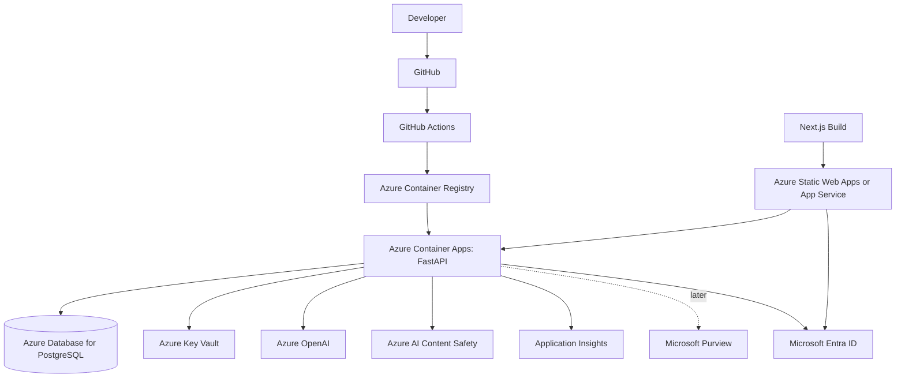

# AI Governance Control Tower

**Document version:** 0.1  
**Date:** 2026-05-12  
**Project mode:** Local-first MVP, Azure-aware architecture  

> This project is a prototype governance layer for registering, monitoring, evaluating, reviewing, and auditing AI systems. It is not a legal compliance product and should not be marketed as guaranteeing compliance with any law, standard, or certification.


## Azure integration strategy

Build locally first, but keep the architecture ready for Azure.

The project should not depend on Azure for the MVP. Instead, the codebase should contain adapter interfaces and optional Azure implementations.

## Local-to-Azure mapping

| Local MVP | Azure target | Purpose |
|---|---|---|
| FastAPI container | Azure Container Apps or App Service | Backend runtime. |
| Next.js local app | Azure Static Web Apps or App Service | Dashboard hosting. |
| Local Postgres | Azure Database for PostgreSQL | Persistent data. |
| `.env` secrets | Azure Key Vault | Secret storage. |
| Mock/local LLM provider | Azure OpenAI / Microsoft Foundry | Model execution. |
| Local prompt/PII checks | Azure AI Content Safety | Safety checks. |
| Local groundedness heuristic | Azure groundedness detection | Output grounding checks. |
| Local mock users | Microsoft Entra ID | Identity and RBAC. |
| Console logs and DB audit | Azure Monitor / Application Insights | Observability. |
| Local data-source metadata | Microsoft Purview | Data governance metadata. |

## Phase 1 — Azure-aware code without Azure dependency

Deliverables:

- `LLMProvider` interface.
- `SafetyProvider` interface.
- `SecretManager` interface.
- `TelemetryProvider` interface.
- Integration settings page.
- Azure adapter stubs.
- Environment variable patterns.

Goal:

> A reviewer can see exactly where Azure plugs in, even if the demo runs locally.

## Phase 2 — Azure OpenAI adapter

Implement:

```text
backend/app/services/llm/azure_openai.py
```

Responsibilities:

- Load endpoint/deployment from config.
- Authenticate with key or managed identity depending on environment.
- Execute chat/completion call.
- Return provider, model version, output, token counts, cost estimate, latency.
- Never expose provider credentials to frontend.

Required configuration:

```text
AZURE_OPENAI_ENDPOINT=
AZURE_OPENAI_API_KEY=
AZURE_OPENAI_DEPLOYMENT_NAME=
AZURE_OPENAI_API_VERSION=
```

Production preference:

- Managed identity where feasible.
- Secrets stored in Key Vault.

## Phase 3 — Azure AI Content Safety adapter

Implement:

```text
backend/app/services/safety/azure_content_safety.py
```

Potential capabilities:

- Input safety check.
- Output safety check.
- Prompt Shields for jailbreak/prompt injection checks.
- Groundedness detection for RAG/summarisation flows.

Configuration:

```text
AZURE_CONTENT_SAFETY_ENDPOINT=
AZURE_CONTENT_SAFETY_KEY=
```

Routing behaviour:

- If content safety returns high severity, block or hold.
- If service unavailable, route medium/high-risk systems to review.
- Store category/severity metadata, not sensitive raw content in audit logs.

## Phase 4 — Key Vault secret manager

Implement:

```text
backend/app/services/secrets/azure_key_vault.py
```

Purpose:

- Retrieve provider keys and connection strings.
- Avoid secrets in app settings.
- Support managed identity.

Configuration:

```text
AZURE_KEY_VAULT_URL=
AZURE_CLIENT_ID=        # optional for user-assigned managed identity
```

Rules:

- Secrets are never returned to frontend.
- Secret values are never logged.
- Integration settings store metadata only.

## Phase 5 — Application Insights / Azure Monitor

Implement:

```text
backend/app/services/telemetry/azure_monitor.py
```

Telemetry to emit:

- Request traces.
- Model run latency.
- Safety provider latency.
- Evaluation latency.
- Route decisions.
- Provider errors.
- Incident counts.

Configuration:

```text
APPLICATIONINSIGHTS_CONNECTION_STRING=
```

Sensitive data policy:

- Do not emit full prompts/outputs by default.
- Use run IDs and system IDs to correlate.
- If a trace includes sensitive content in dev, it must be disabled in production.

## Phase 6 — Microsoft Entra ID

Target:

- Entra ID authenticates dashboard users.
- Backend validates tokens.
- Entra groups map to app roles.

Suggested app roles:

- GovernanceAdmin.
- Reviewer.
- SystemOwner.
- Auditor.
- Viewer.

Backend remains source of permission enforcement.

## Phase 7 — Microsoft Purview

Purview should be a later integration, not MVP blocker.

Potential features:

- Import data source classifications.
- Show which AI systems touch sensitive data.
- Link model runs to governed data sources.
- Flag AI systems using unclassified data.
- Show data lineage or catalog references.

MVP approach:

- Store local data-source metadata in Postgres.
- Build `DataGovernanceProvider` interface.
- Add a Purview integration card with planned connection state.

## Integration settings UI

Create `/settings/integrations` page with cards:

| Integration | Status values | MVP behaviour |
|---|---|---|
| Azure OpenAI | local_mock/configured/connected/error | Show provider mode and deployment name. |
| Azure AI Content Safety | local_mock/configured/connected/error | Show checks enabled. |
| Azure Key Vault | disabled/configured/connected/error | Show vault URL metadata only. |
| Application Insights | disabled/configured/connected/error | Show telemetry enabled state. |
| Microsoft Entra ID | local_mock/configured/connected/error | Show auth mode. |
| Microsoft Purview | planned/configured/connected/error | Show data governance status. |

## Deployment target architecture



## Infrastructure-as-code options

Use one of:

- Bicep for Azure-native IaC.
- Terraform for cross-cloud familiarity.

MVP can include Bicep templates as examples, but local development should not require them.

Suggested Azure resources:

- Resource group.
- Container App Environment.
- Container App for backend.
- Static Web App or App Service for frontend.
- Azure Database for PostgreSQL.
- Key Vault.
- Application Insights.
- Log Analytics Workspace.
- Azure OpenAI resource.
- Azure AI Content Safety resource.
- Optional Azure Container Registry.

## Security considerations

- Prefer managed identity over static credentials.
- Store secrets in Key Vault.
- Do not expose model endpoints to browser.
- Use private networking later if needed.
- Use RBAC and least privilege.
- Validate Entra tokens in backend.
- Configure CORS strictly.
- Emit telemetry without sensitive content.
- Use deployment slots or staged rollout for production.

## References to verify during integration

- Azure AI Content Safety: https://learn.microsoft.com/en-us/azure/ai-services/content-safety/
- Prompt Shields: https://learn.microsoft.com/en-us/azure/ai-services/content-safety/concepts/jailbreak-detection
- Groundedness detection: https://learn.microsoft.com/en-us/azure/ai-services/content-safety/concepts/groundedness
- Microsoft Foundry evaluations: https://learn.microsoft.com/en-us/azure/foundry/how-to/evaluate-generative-ai-app
- Azure Key Vault: https://learn.microsoft.com/en-us/azure/key-vault/
- Application Insights OpenTelemetry: https://learn.microsoft.com/en-us/azure/azure-monitor/app/opentelemetry-enable
- Microsoft Entra ID: https://learn.microsoft.com/en-us/entra/identity/

## Demo positioning

Recommended wording:

> This project runs locally first, but every major control has a cloud integration point. In Azure, the LLM provider can become Azure OpenAI, safety checks can use Azure AI Content Safety and Prompt Shields, secrets can move into Key Vault, identity can move into Entra ID, and observability can flow into Application Insights.

Avoid:

> This is Azure-compliant AI governance software.
