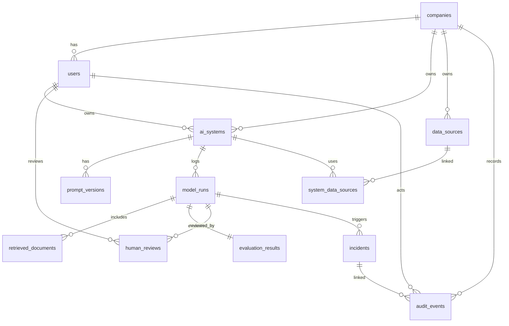

# AI Governance Control Tower

**Document version:** 0.1  
**Date:** 2026-05-12  
**Project mode:** Local-first MVP, Azure-aware architecture  

> This project is a prototype governance layer for registering, monitoring, evaluating, reviewing, and auditing AI systems. It is not a legal compliance product and should not be marketed as guaranteeing compliance with any law, standard, or certification.


## Data model goals

The data model must support:

- AI system registration.
- Ownership and departments.
- Risk and approval state.
- Data source relationships.
- Prompt versioning.
- Governed model runs.
- Retrieved document metadata.
- Automated evaluations.
- Human review.
- Incidents.
- Audit events.
- Dashboard aggregations.

## Entity relationship overview



## Enums

### Risk level

```text
low
medium
high
critical
```

### Approval status

```text
pending
approved
blocked
retired
```

### Review decision

```text
pending
approved
rejected
escalated
needs_changes
```

### Route decision

```text
allow
allow_with_review
hold_for_review
block
```

### Incident type

```text
pii_exposure
hallucination
policy_violation
jailbreak_attempt
unapproved_use
data_leakage
cost_anomaly
security_event
other
```

### Incident status

```text
open
investigating
resolved
dismissed
escalated
```

### Severity

```text
low
medium
high
critical
```

## Tables

### `companies`

| Column | Type | Notes |
|---|---|---|
| `id` | UUID PK | Company ID. |
| `name` | text | Example: Acme Corp. |
| `slug` | text unique | URL-safe identifier. |
| `created_at` | timestamptz | Created timestamp. |
| `updated_at` | timestamptz | Updated timestamp. |

### `users`

| Column | Type | Notes |
|---|---|---|
| `id` | UUID PK | User ID. |
| `company_id` | UUID FK | Tenant/company. |
| `name` | text | Display name. |
| `email` | text | Unique per company. |
| `role` | enum/text | viewer, owner, reviewer, admin, auditor. |
| `department` | text nullable | Used for filters/permissions. |
| `created_at` | timestamptz | Created timestamp. |

### `ai_systems`

| Column | Type | Notes |
|---|---|---|
| `id` | UUID PK | System ID. |
| `company_id` | UUID FK | Company. |
| `name` | text | Customer Support Summariser. |
| `description` | text | Plain-language system purpose. |
| `department` | text | Owning department. |
| `owner_user_id` | UUID FK nullable | Optional linked user. |
| `owner_name` | text | Display owner if no user. |
| `owner_email` | text | Owner email. |
| `model_provider` | text | local, openai, anthropic, azure_openai. |
| `model_name` | text | GPT-4.1, Claude, local model, etc. |
| `data_sources` | json/text[] | Episode 2 stores source names directly before the data-source catalogue exists. |
| `contains_personal_data` | boolean | Declared by owner. |
| `human_oversight_required` | boolean | Required before/after output. |
| `risk_level` | enum/text | Episode 2 values: low/medium/high/critical. |
| `approval_status` | enum/text | Episode 2 values: pending/approved/blocked/retired. |
| `approval_reason` | text nullable | Reason for current approval state. |
| `approved_by_user_id` | UUID FK nullable | Approver. |
| `approved_at` | timestamptz nullable | Approval timestamp. |
| `created_at` | timestamptz | Created timestamp. |
| `updated_at` | timestamptz | Updated timestamp. |

The local app applies Alembic migrations on startup and seeds three synthetic systems when missing:

- Customer Support Summariser: medium risk, pending, contains personal data.
- Sales Email Generator: low risk, approved, no personal data.
- HR CV Screening Assistant: high risk, blocked, contains personal data.

### `data_sources`

| Column | Type | Notes |
|---|---|---|
| `id` | UUID PK | Data source ID. |
| `company_id` | UUID FK | Company. |
| `name` | text | Zendesk, Salesforce CRM, Product Docs. |
| `source_type` | text | support, crm, docs, database, vector_store, other. |
| `description` | text nullable | Description. |
| `sensitivity` | enum/text | public/internal/confidential/personal/restricted. |
| `external_ref` | text nullable | External connector ref. |
| `created_at` | timestamptz | Created timestamp. |

### `system_data_sources`

Join table.

| Column | Type | Notes |
|---|---|---|
| `ai_system_id` | UUID FK | AI system. |
| `data_source_id` | UUID FK | Data source. |
| `access_purpose` | text nullable | Why this system needs source. |
| `created_at` | timestamptz | Link timestamp. |

### `prompt_versions`

| Column | Type | Notes |
|---|---|---|
| `id` | UUID PK | Prompt version ID. |
| `ai_system_id` | UUID FK | AI system. |
| `version` | integer | Increment per system. |
| `name` | text | Optional label. |
| `prompt_text` | text | System/developer prompt template. |
| `status` | text | draft, active, retired. |
| `created_by_user_id` | UUID FK | Creator. |
| `created_at` | timestamptz | Created timestamp. |
| `activated_at` | timestamptz nullable | Active timestamp. |

Episode 4 local MVP creates a default active `v1` prompt version for every registered system. Additional versions can be created as drafts and activated through the API; activation retires the previous active version for the same system.

### `model_runs`

Episode 4 local MVP implements a focused subset: `id`, `ai_system_id`, nullable `prompt_version_id`, `prompt`, `input_text`, nullable `output_text`, `model_provider`, `model_name`, `model_version`, `latency_ms`, `cost_usd`, `status`, and `created_at`.

Episode 5 adds `input_pii_result` and `output_pii_result` JSON fields. These store detector metadata such as `pii_detected`, `pii_types`, redacted snippets, and confidence label.

| Column | Type | Notes |
|---|---|---|
| `id` | UUID PK | Run ID. |
| `company_id` | UUID FK | Company. |
| `ai_system_id` | UUID FK | System. |
| `prompt_version_id` | UUID FK nullable | Prompt version. |
| `actor_user_id` | UUID FK nullable | User/app initiating run. |
| `route_decision` | enum | allow, allow_with_review, hold_for_review, block. |
| `route_reasons` | jsonb | Explain route decision. |
| `prompt` | text | Prompt used. Sensitive. |
| `input_text` | text | Input. Sensitive. |
| `output_text` | text nullable | Output. Sensitive. |
| `model_provider` | text | Provider. |
| `model_version` | text | Provider model/version. |
| `input_tokens` | integer nullable | Token count. |
| `output_tokens` | integer nullable | Token count. |
| `cost_usd` | numeric nullable | Estimated/provided cost. |
| `latency_ms` | integer nullable | Total latency. |
| `request_metadata` | jsonb | Source, environment, trace IDs. |
| `created_at` | timestamptz | Run timestamp. |

### `retrieved_documents`

Episode 4 local MVP stores supplied retrieved document text as run evidence with `source_label`, `content`, and `ordinal`. Registered data-source linkage and retrieval scores remain later enhancements.

| Column | Type | Notes |
|---|---|---|
| `id` | UUID PK | Retrieved doc ID. |
| `model_run_id` | UUID FK | Run. |
| `data_source_id` | UUID FK nullable | Linked registered source. |
| `document_ref` | text | External ref or synthetic ID. |
| `title` | text nullable | Display title. |
| `snippet` | text nullable | Redacted snippet. |
| `sensitivity` | text | Classification. |
| `score` | numeric nullable | Retrieval score. |
| `metadata` | jsonb | Source metadata. |

### `evaluation_results`

| Column | Type | Notes |
|---|---|---|
| `id` | UUID PK | Evaluation ID. |
| `model_run_id` | UUID FK unique | One evaluation per run for MVP. |
| `pii_detected` | boolean | Any PII in input/output. |
| `pii_types` | jsonb | Types only, not values. |
| `prompt_injection_flag` | boolean | Prompt/jailbreak flag. |
| `hallucination_flag` | boolean | Groundedness/factuality signal. |
| `toxicity_score` | numeric nullable | Optional. |
| `groundedness_score` | numeric nullable | 0–1. |
| `relevance_score` | numeric nullable | 0–1. |
| `overall_score` | numeric | 0–100 or 0–1; choose one and document. |
| `passed` | boolean | Whether evaluation passed thresholds. |
| `requires_human_review` | boolean | Route indicator. |
| `summary` | text | Plain-language explanation. |
| `raw_results` | jsonb | Raw evaluator output. |
| `created_at` | timestamptz | Timestamp. |

### `human_reviews`

| Column | Type | Notes |
|---|---|---|
| `id` | UUID PK | Review ID. |
| `company_id` | UUID FK | Company. |
| `model_run_id` | UUID FK | Run. |
| `assigned_to_user_id` | UUID FK nullable | Reviewer. |
| `status` | text | pending/in_review/completed. |
| `decision` | enum nullable | approved/rejected/escalated/needs_changes. |
| `reason` | text | Why review was created. |
| `notes` | text nullable | Reviewer notes. |
| `created_at` | timestamptz | Created. |
| `completed_at` | timestamptz nullable | Completed. |

### `incidents`

Episode 5 local MVP implements incidents for PII detection. PII incidents are created when local regex checks detect synthetic PII in model input or output.

| Column | Type | Notes |
|---|---|---|
| `id` | UUID PK | Incident ID. |
| `ai_system_id` | UUID FK | System. |
| `model_run_id` | UUID FK nullable | Linked run. |
| `incident_type` | text | `pii_detected_input`, `pii_detected_output`, etc. |
| `severity` | enum | Severity. |
| `status` | enum | Status. |
| `title` | text | Short title. |
| `description` | text | Explanation. |
| `created_at` | timestamptz | Detection time. |
| `updated_at` | timestamptz | Last update time. |

### `audit_events`

| Column | Type | Notes |
|---|---|---|
| `id` | UUID PK | Audit event ID. |
| `company_id` | UUID FK | Company. |
| `actor_user_id` | UUID FK nullable | User/service. |
| `action` | text | e.g. system.approved. |
| `entity_type` | text | ai_system, model_run, incident. |
| `entity_id` | UUID/text | Entity ID. |
| `before_state` | jsonb nullable | Redacted previous state. |
| `after_state` | jsonb nullable | Redacted new state. |
| `metadata` | jsonb | Request ID, reason, IP, etc. |
| `created_at` | timestamptz | Timestamp. |

### `integration_connections`

| Column | Type | Notes |
|---|---|---|
| `id` | UUID PK | Integration ID. |
| `company_id` | UUID FK | Company. |
| `provider` | text | azure_openai, content_safety, purview, monitor. |
| `status` | text | local_mock, configured, connected, disabled, error. |
| `display_name` | text | Card title. |
| `config_metadata` | jsonb | Non-secret metadata only. |
| `last_checked_at` | timestamptz nullable | Health check time. |
| `created_at` | timestamptz | Created. |

## Index recommendations

Add indexes on:

- `ai_systems(company_id, department)`
- `ai_systems(company_id, risk_level)`
- `ai_systems(company_id, approval_status)`
- `model_runs(company_id, created_at)`
- `model_runs(ai_system_id, created_at)`
- `evaluation_results(model_run_id)`
- `human_reviews(company_id, status, created_at)`
- `incidents(company_id, status, severity, detected_at)`
- `audit_events(company_id, created_at)`
- `audit_events(entity_type, entity_id)`

## Sensitive fields

These fields require special access controls:

- `model_runs.prompt`
- `model_runs.input_text`
- `model_runs.output_text`
- `retrieved_documents.snippet`
- `evaluation_results.raw_results`
- `human_reviews.notes`
- `audit_events.before_state`
- `audit_events.after_state`

Frontend should show redacted previews unless user role allows full access.

## Retention considerations

MVP can store all records indefinitely. Later:

| Data | Suggested retention policy |
|---|---|
| Audit events | Long retention, possibly immutable. |
| Model run content | Shorter configurable retention. |
| Evaluation metadata | Longer retention than raw content. |
| Incidents | Long retention. |
| Prompt versions | Long retention. |
| Cost/usage aggregates | Long retention. |

## Demo seed data requirements

Seed data should create realistic density:

- 18–25 AI systems.
- 5 departments.
- 30 days of model runs.
- 2–5 incidents.
- 5–10 human review items.
- A few blocked/pending systems.
- At least one prompt version history.
- At least one audit log trail for an approval change.
