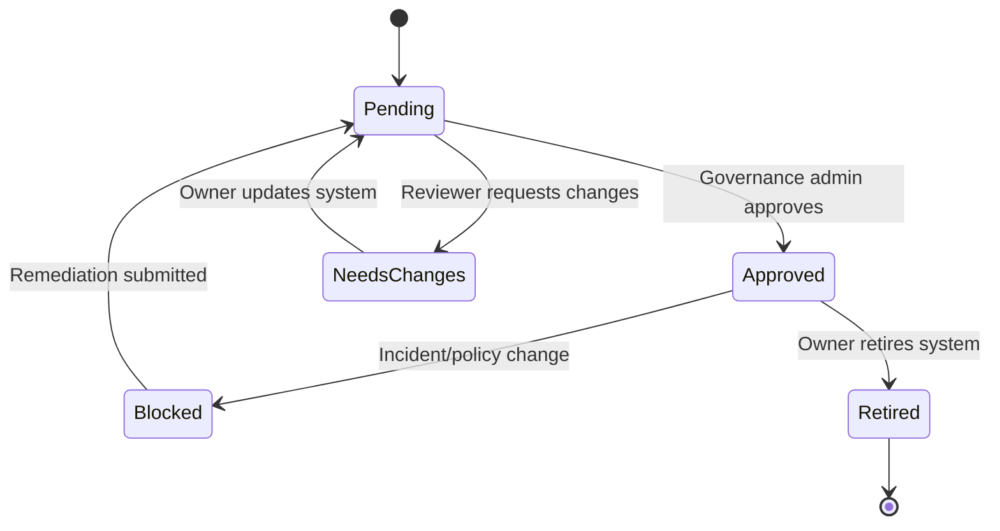

# AI Governance Control Tower

**Document version:** 0.1  
**Date:** 2026-05-12  
**Project mode:** Local-first MVP, Azure-aware architecture  

> This project is a prototype governance layer for registering, monitoring, evaluating, reviewing, and auditing AI systems. It is not a legal compliance product and should not be marketed as guaranteeing compliance with any law, standard, or certification.


## Governance model objective

The governance model defines how the system decides whether AI use is visible, approved, safe enough to run, routed to review, blocked, or escalated as an incident.

The model should be explainable and conservative. It should generate evidence, not false certainty.

## Governance principles

- **Visibility:** every AI system should be registered.
- **Ownership:** every system needs an accountable owner.
- **Approval:** risky systems should not run without approval.
- **Data awareness:** systems using personal or sensitive data need stronger controls.
- **Human oversight:** risky or uncertain outputs route to people.
- **Auditability:** decisions and changes are recorded.
- **Proportionality:** low-risk systems should not be governed like high-risk systems.
- **Evidence over vibes:** scores should be backed by reasons and metadata.

## AI system registration questions

Minimum fields:

- System name.
- Description.
- Department.
- Owner.
- Model provider/name.
- Data sources.
- Contains personal data?
- Intended users.
- Human oversight required?
- Risk level.
- Approval status.

Optional later fields:

- Intended purpose.
- Prohibited uses.
- Impacted stakeholders.
- Data retention period.
- Evaluation schedule.
- Monitoring owner.
- Legal/business reviewer.
- Deployment environment.

## Risk level rubric

### Low risk

Examples:

- Internal summarisation of non-sensitive public/internal docs.
- Drafting marketing copy with human review.
- Non-decision-support productivity assistant.

Controls:

- Registry required.
- Logging required.
- Basic checks.
- Review only on failed evaluations.

### Medium risk

Examples:

- Customer support summarisation.
- Sales email drafting using CRM context.
- Internal analytics assistant with confidential data.

Controls:

- Approval required.
- Personal data check.
- Human review for flagged outputs.
- Incident creation for PII leakage or hallucination.

### High risk

Examples:

- HR screening support.
- Finance decision support.
- Healthcare, legal, or regulated workflows.
- Systems influencing access, eligibility, or significant decisions.

Controls:

- Approval required.
- Human oversight required.
- Stricter thresholds.
- Outputs may be held before release.
- Stronger audit/export controls.

### Critical risk

Examples:

- Automated high-impact decisions without human oversight.
- Use of restricted data without controls.
- Safety-critical workflows.

Controls:

- Block by default in MVP.
- Governance admin review required.
- No direct output release.

## Approval workflow



Approval statuses:

| Status | Meaning |
|---|---|
| `pending` | Registered but not approved for use. |
| `approved` | Allowed to execute under defined controls. |
| `blocked` | Not allowed to execute. |
| `needs_changes` | Registration/prompt/policy must be updated. |
| `retired` | No longer active. |

## Governance gateway policy

The gateway evaluates:

- System approval state.
- System risk level.
- User role and department.
- Prompt version status.
- Personal data declaration.
- Data source permissions.
- Prompt/input policy checks.
- PII in input.
- Prompt injection/jailbreak signal.
- Retrieval document sensitivity.
- Provider availability.

Planned control services:

- PII detection using Microsoft Presidio/Presidio where available, plus regex, NER, and entity detection fallback.
- Prompt injection detection covering jailbreak attempts, suspicious prompt heuristics, and tool restriction logic.
- Redaction before LLM execution for names, emails, phone numbers, and account numbers.
- Role-based access for admin, analyst, reviewer, and auditor workflows.
- Audit capture for prompts, outputs, retrieved docs, approvals, costs, and reviewer actions.

Route decisions:

```text
allow
allow_with_review
hold_for_review
block
```

### Episode 3 and 4 local gateway rules

Episode 3 implements the first runtime gateway at `POST /governance/run`. Episode 4 adds persistent run logging for executed calls.

| Approval status | Gateway status | Execution behaviour |
|---|---|---|
| `approved` | `executed` | Calls `LocalMockLLMProvider` and returns mock output. |
| `pending` | `requires_review` | Does not execute. The system must be reviewed before model execution. |
| `blocked` | `blocked` | Does not execute. A governance audit event is recorded. |
| `retired` | `blocked` | Does not execute. A governance audit event is recorded. |
| missing system | HTTP 404 | Returns `AI_SYSTEM_NOT_FOUND`. |

Provider boundary:

- `LLMProvider` is the backend interface for model execution.
- `LocalMockLLMProvider` is the only active Episode 3 implementation.
- `AzureOpenAIProvider` is a placeholder and must not require credentials until the Azure integration phase.

Audit behaviour:

- Executed gateway calls record `governance.run.executed`.
- Blocked calls record `governance.run.blocked`.
- Pending calls record `governance.run.requires_review`.
- Executed calls create `model_runs` records with prompt, input, output, provider metadata, latency, mock cost, and status.
- Supplied retrieved documents are stored as `retrieved_documents` linked to the model run.
- Blocked and pending calls remain audit-only in Episode 4 and do not create model-run records.

## V2 multi-agent governance model

The V2 direction is a genuine multi-agent governance system. Agents are bounded backend services with typed contracts, explicit permissions, observable decisions, and audit events. They should not silently change approval states or execute model/provider calls outside the gateway.

| Agent | Responsibilities |
|---|---|
| Retrieval Agent | Semantic retrieval, hybrid retrieval, reranking, source grounding. |
| Evaluation Agent | Hallucination scoring, groundedness, policy validation, confidence scoring. |
| Compliance Agent | PII detection, policy checks, prompt injection detection, output sanitisation. |
| Human Review Agent | Escalate risky outputs, route to reviewer, generate audit summary, maintain approval workflow. |
| Reporting Agent | Telemetry, cost tracking, latency metrics, weekly insights. |

## Dynamic risk scoring

Suggested MVP formula:

```text
base_score = risk_level_weight
+ personal_data_weight
+ input_pii_weight
+ prompt_injection_weight
+ sensitive_document_weight
+ unapproved_prompt_weight
+ user_permission_weight
```

Example weights:

| Factor | Weight |
|---|---:|
| Low risk system | 10 |
| Medium risk system | 30 |
| High risk system | 55 |
| Critical risk system | 80 |
| Contains personal data | +15 |
| PII detected in input | +15 |
| PII detected in output | +25 |
| Prompt injection signal | +35 |
| Sensitive retrieved document | +15 |
| Human oversight required | +10 |
| Unapproved/pending system | Block, not score |
| Blocked system | Block, not score |

Thresholds:

| Score | Route |
|---:|---|
| 0–34 | Allow. |
| 35–59 | Allow with review or review if flagged. |
| 60–79 | Hold for review. |
| 80+ | Block or critical review. |

These thresholds are demo defaults and should be configurable.

## Post-execution evaluation model

Checks:

| Check | What it detects | MVP implementation |
|---|---|---|
| Output PII | Sensitive data in generated output. | Regex/heuristics. |
| Output safety | Harmful/toxic/policy-violating text. | Heuristic/local provider. |
| Groundedness | Output unsupported by retrieved docs. | Source overlap heuristic. |
| Relevance | Output does not answer the request. | Keyword/embedding heuristic later. |
| Consistency | Contradiction or fabricated detail. | Heuristic/manual review. |
| Cost/latency anomaly | Unexpected usage. | Thresholds. |

Evaluation result should include:

- Overall score.
- Per-check scores.
- Flags.
- Explanation.
- Evidence snippets where safe.
- Review requirement.

## Human review routing

Create human review if:

- System requires human oversight and output was generated.
- PII detected in output.
- Prompt injection detected.
- Hallucination/groundedness flag triggered.
- Evaluation score below threshold.
- High-risk system generates output.
- Reviewer is explicitly requested.

Review priorities:

| Priority | Trigger |
|---|---|
| Critical | Critical risk, blocked system attempt, severe PII exposure. |
| High | PII output, jailbreak, high-risk system. |
| Medium | Hallucination, medium risk with failed eval. |
| Low | Low relevance, minor formatting issues. |

## Incident creation policy

Create incident if:

- PII exposed in output for a medium/high/critical system.
- Prompt injection/jailbreak signal is high severity.
- System execution attempted while blocked.
- Output contains a policy violation.
- Hallucination is detected in a high-risk context.
- Cost/usage anomaly exceeds threshold.

Do not create an incident for every minor failed evaluation, or the dashboard becomes noisy. Use review queue for lower-severity items.

## Audit policy

Audit events are required for:

- System create/update.
- Approval status changes.
- Prompt version activation.
- Gateway route decisions.
- Review creation and decision.
- Incident creation/update/resolution.
- Audit export.
- Integration setting changes.

## Governance posture score

Optional MVP+ feature.

Suggested components:

| Component | Weight |
|---|---:|
| Registry completeness | 20 |
| Approval coverage | 20 |
| Review SLA | 15 |
| Incident resolution | 15 |
| Evaluation pass rate | 15 |
| Data-source classification coverage | 10 |
| Prompt version control | 5 |

Example:

```text
Governance posture: 72 / 100
```

Display explanation:

```text
This score is a governance signal based on registry completeness, unresolved incidents, review backlog, and evaluation failure rates. It is not a compliance certification.
```

## Framework alignment

### NIST AI RMF mapping

| NIST AI RMF function | Project feature |
|---|---|
| Govern | Registry, ownership, approvals, policies, audit logs. |
| Map | System purpose, data sources, departments, risk levels. |
| Measure | Evaluations, PII checks, groundedness, failure rates. |
| Manage | Review queue, incidents, blocking, remediation, exports. |

### Responsible AI principles mapping

| Principle | Project feature |
|---|---|
| Transparency | System detail pages, run logs, audit logs. |
| Accountability | Owners, reviewers, decisions, audit trail. |
| Privacy | PII detection, redaction, review routing. |
| Safety | Prompt and output checks. |
| Reliability | Evaluations and failure trends. |
| Human oversight | Review queue and decision workflow. |

## Governance language rules

Use:

- “Risk signal.”
- “Governance evidence.”
- “Approval workflow.”
- “Audit-ready export.”
- “Framework-aligned prototype.”

Avoid:

- “Fully compliant.”
- “Regulator approved.”
- “Guaranteed safe.”
- “Eliminates hallucinations.”
- “Automatic compliance.”

## Limitations to show clearly

- Risk scoring is configurable and contextual.
- PII detection is imperfect.
- Groundedness does not prove truth.
- Human review can still make mistakes.
- Audit logs are only useful if access and retention are managed.
- Governance dashboards can create false confidence if metrics are not interpreted carefully.
